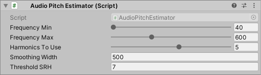

# Audio Pitch Estimator for Unity

Unity上で**基本周波数**（音の高さ）をリアルタイム検出・推定するスクリプトです。


## デモ

リポジトリの Unity プロジェクト内にサンプルがあります。

- `Assets/Examples/Example1.unity`
  - **音声ファイル**から音の高さを推定
  - 権利関係上、自前で用意した歌声を使用しています
- `Assets/Examples/Example2.unity`
  - **マイクでリアルタイム収録**しながら音の高さを推定
  - 一旦 AudioSource へ録音してから推定するため1秒程度の遅延があります


## 使い方

適当なゲームオブジェクトに `AudioPitchEstimator.cs` をアタッチしてください。



- **Frequency Min**: 推定時の最低周波数です。
- **Frequency Max**: 推定時の最大周波数です。
- **Harmonics To Use**: 推定に使用する倍音の個数です。
- **Smoothing Width**: スペクトルの移動平均平滑化に用いる周波数バンドの幅です。
- **Threshold SRH**: 基本周波数が検出されたか否かを決める閾値です。この値が高いほど、判定が厳しくなります。


### 調整のTips

#### ブレやすい、候補が同時に2つ出現している

周波数の高い候補が除外されるよう **Frequency Max** を下げてください。

#### 発声の末尾などで誤判定が起きる

無音判定を厳しくすると改善することがあります。 **Threshold SRH** の値を上げてください。
それでも改善しない場合は、様子を見ながら **Harmonics To Use** や **Smoothing Width** を調整してください。

#### たまに判定されないことがある

無音判定が厳しすぎる状態です。 **Threshold SRH** の値を下げてください。
それでも改善しない場合は、様子を見ながら **Harmonics To Use** や **Smoothing Width** を調整してください。

#### 計算負荷が高すぎる

推定する時間間隔を広げると効果的です（例: `PitchVisualizer` の `EstimateRate` を `8` に下げる）。


## コード例

音声データは **AudioSource** 経由で取得します。
マイクの音声を利用したい場合は、Unity に組み込まれている [Microphone.Start()](https://docs.unity3d.com/ja/current/ScriptReference/Microphone.Start.html) を併用してください。

 `AudioPitchEstimator.Estimate()` に AudioSource を渡すと、基本周波数を推定して返します。

```cs
void EstimatePitch()
{
    var estimator = this.GetComponent<AudioPitchEstimator>();
	var audioSource = this.GetComponent<AudioSource>();

    // AudioSourceの出力から基本周波数を推定
    float frequency = estimator.Estimate(audioSource);
    if (float.IsNaN(frequency))
    {
        // 基本周波数を推定できなかった（無音の場合など）
    }
    else
    {
        // 基本周波数を推定できた
        // frequencyに基本周波数(Hz)が代入されている
    }
}

void Update()
{
    // 計算負荷が高いため、毎フレーム実行はおすすめしません
    //EstimatePitch();
}

void Start()
{
    // 時間間隔をあけて推定することをおすすめします
    // この例では0.1秒ごとに推定します
    InvokeRepeating("EstimatePitch", 0, 0.1f);
}
```


## アルゴリズム

SRH (Summation of Residual Harmonics) [1] と呼ばれる基本周波数推定法を実装しています。

詳細は文献 [1] や `AudioPitchEstimator.cs` を参照してください。


## ライセンス

The Unlicense. For the details, see [LICENSE](./LICENSE). 


## 参考文献

[1] T. Drugman and A. Alwan: "[Joint Robust Voicing Detection and Pitch Estimation Based on Residual Harmonics](https://arxiv.org/abs/2001.00459)", Interspeech'11, 2011. 

